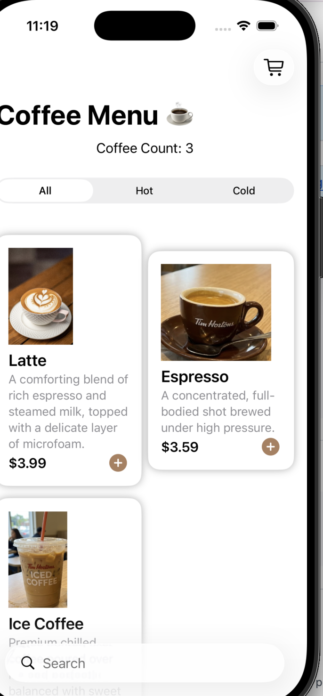
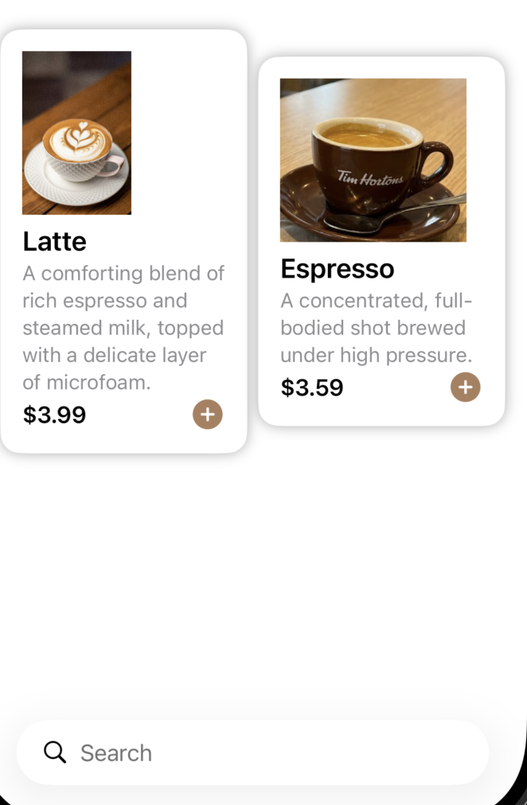
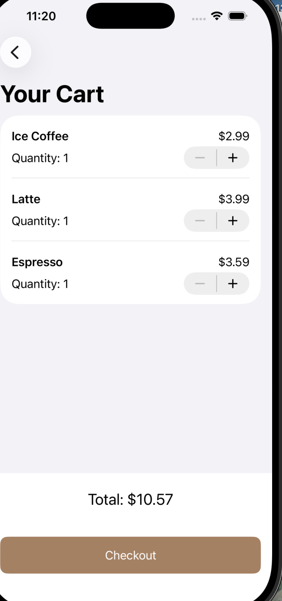

# CoffeeApp2 

## Overview

CoffeeApp2 is a SwiftUI-based mobile coffee ordering application that simulates a modern café ordering experience.  
Users can browse drinks, filter by category, search items, and manage a fully persistent shopping cart powered by SwiftData.

## Features

* **Animated Onboarding:** A smooth splash screen experience (`SplashScreen.swift`) with automatic navigation transitions.
* **Persistent Architecture:** Uses **SwiftData** for local data storage and state persistence across app launches.
* **Dynamic Data Seeding:** Loads initial coffee menu data from a local JSON file (`coffeeData.json`) with fallback handling.
* **Live Search & Filtering:** Real-time filtering by name with category segmentation (**Hot**, **Cold**, **All**).
* **Cart Management:** Add, update, and remove items with real-time UI updates and swipe-to-delete support.

## Tech Stack & Frameworks

* **iOS 17.0+**
* **Swift 5.9+**
* **SwiftUI** – Declarative UI framework
* **SwiftData** – Data persistence layer
* **Combine** – Reactive state management using `@Published` and `ObservableObject`

## Project Architecture

CoffeeApp2/
│
├── DataLoader/
│   └── DataLoader.swift         # JSON data parsing helper
│
├── Manager/
│   └── CartManager.swift        # Cart state and business logic
│
├── Model/
│   ├── CartItem.swift           # Cart item data model
│   └── Coffee.swift             # Coffee product model (SwiftData + Codable)
│
├── Resources/
│   └── coffeeData.json          # Initial coffee menu dataset
│
├── Views/
│   ├── CartView.swift           # Shopping cart screen
│   ├── CoffeeCardView.swift     # Reusable coffee item UI component
│   └── ContentView.swift        # Main menu with search & filters
│
├── Assets.xcassets              # Images, icons, and colors
├── CoffeeApp2App.swift          # App entry point
└── SplashScreen.swift           # Animated launch screen

## 📸 Screenshots

### Menu Screen

### Hot Drinks Filter

### Shopping Cart
